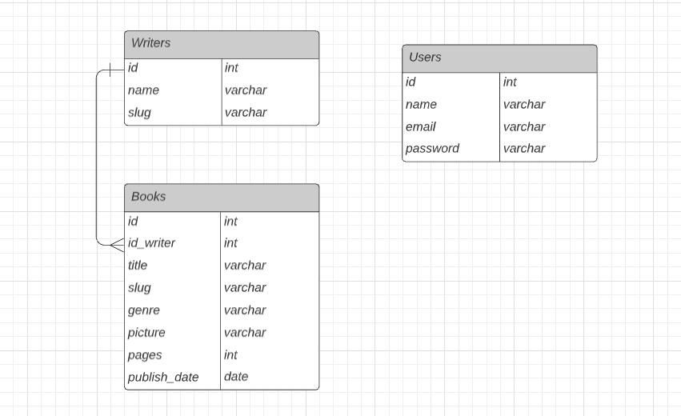

# Aplikasi pengelolaan data buku

Aplikasi berbasis web untuk admin yang digunakan untuk mengolah data buku dan penulis.
Admin dapat melakukan CRUD data buku dan penulis. Aplikasi ini juga dapat menghasilkan API
dari data yang telah diinputkan.

---

## Desain Database

Tabel Writers berelasi one to many dengan tabel Books.


---

## Screenshot Aplikasi

### 1. Halaman Writer

-   Terdapat kolom nama penulis, dan jumlah buku yang telah ditulis(berelasi dengan tabel buku).
    

-   Halaman untuk menambahkan data penulis.
    

### 2. Halaman Book

-   Terdapat kolom nama gambar, judul buku, penulis(berelasi dengan tabel penulis), genre,
    jumlah halaman, dan tanggal terbit.
    

-   Halaman untuk menambahkan data buku.
    

---

## Depedency

-   laravel/ui

```
composer require laravel/ui --dev;

php artisan ui vue --auth;
```

-   Sanctum

```
composer require laravel/sanctum
```

---

## Jika ingin mengembangkan project ini

### Clone Repository

`git clone https://github.com/dprastha/daftar-buku-app.git`

### Import Database

Import database to phpmyadmin on folder `importDB/daftar_buku_app.sql`

### Setting .env

Copy dari file `.env.example` dan sesuaikan dengan kebutuhan.

## Running Development

`php artisan serve`

---

## Dokumentasi API

https://documenter.getpostman.com/view/13334944/TzY4gb7m
